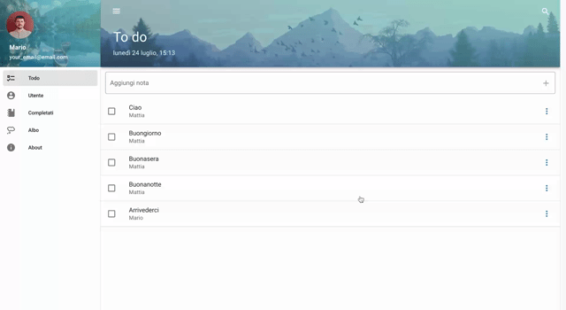

# Vuetify To Do app

To Do is a todo list web application. It can manage your daily tasks in a user-friendly and efficient way. The design of this app is based off a [Danny Cornell](https://www.udemy.com/user/dannyconnell/) tutorial, with added functionalities.

It is fully localized in Italian and you can find it on Netlify at [this address](https://todoita-vuetify.netlify.app/?#/).

## Features

- **User Login**: Users can enter their name in the **Utente** page and pseudo login to be granted permission to create their personalized todo list.
  

- **Task Management**: Users can add, edit, schedule and delete tasks. Tasks can be marked as completed and viewed in the **Completati** section.
  

- **Search**: Users can search for tasks by their title or the user who created them.
  

- **Task Sorting**: Tasks can be sorted by selecting the option in the menu and then dragging them to the desired slot.
  

- **Albo View**: Users can view XKCD comics, with navigation buttons to fetch and display the next or previous comic. The details of the comic (title, date, comic number) are also displayed.
  

## Installation

1. Clone the repository to your local machine using `git clone https://github.com/yourusername/todoita.git`.
2. Install dependencies using `npm install`.
3. Start the application using `npm run serve`.
4. Open a web browser and navigate to `localhost:8080`.

## Dependencies

ToDoIta uses several dependencies to function correctly:

- **Vue.js**: A progressive JavaScript framework used for building user interfaces.
- **Vuex**: A state management pattern and library for Vue.js applications.
- **Vue Router**: The official router for Vue.js, used for building single-page applications.
- **Vuetify**: A Vue UI library that follows the Material Design spec.
- **Axios**: A promise-based HTTP client that works in the browser and Node.js, used for making API requests.

## API Requests

The application makes API requests to a backend server to fetch and manipulate data. API requests are handled using the Axios library. A server-side proxy is set up to overcome the CORS issues when making requests from the frontend to the backend server.

## License

[MIT](https://choosealicense.com/licenses/mit/)
